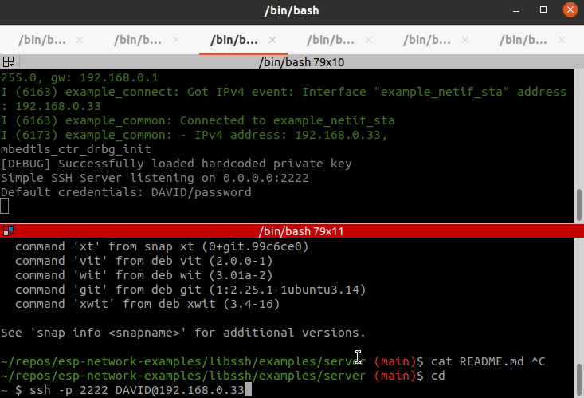

# libssh

A minimal ESP-IDF port of libssh.
The purpose of this component is to provide a way to run `sshd` on your ESP32 device, so you can "ssh" into your device.

## How to use

Add the libssh subdirectory to your component list, either using IDF build system or by means of the component yaml file:
```
dependencies:
  libssh:
    version: '*'
    path: /path/to/the_libssh_directory/
```

## Example

See the simple server example in [server](libssh/examples/server)


